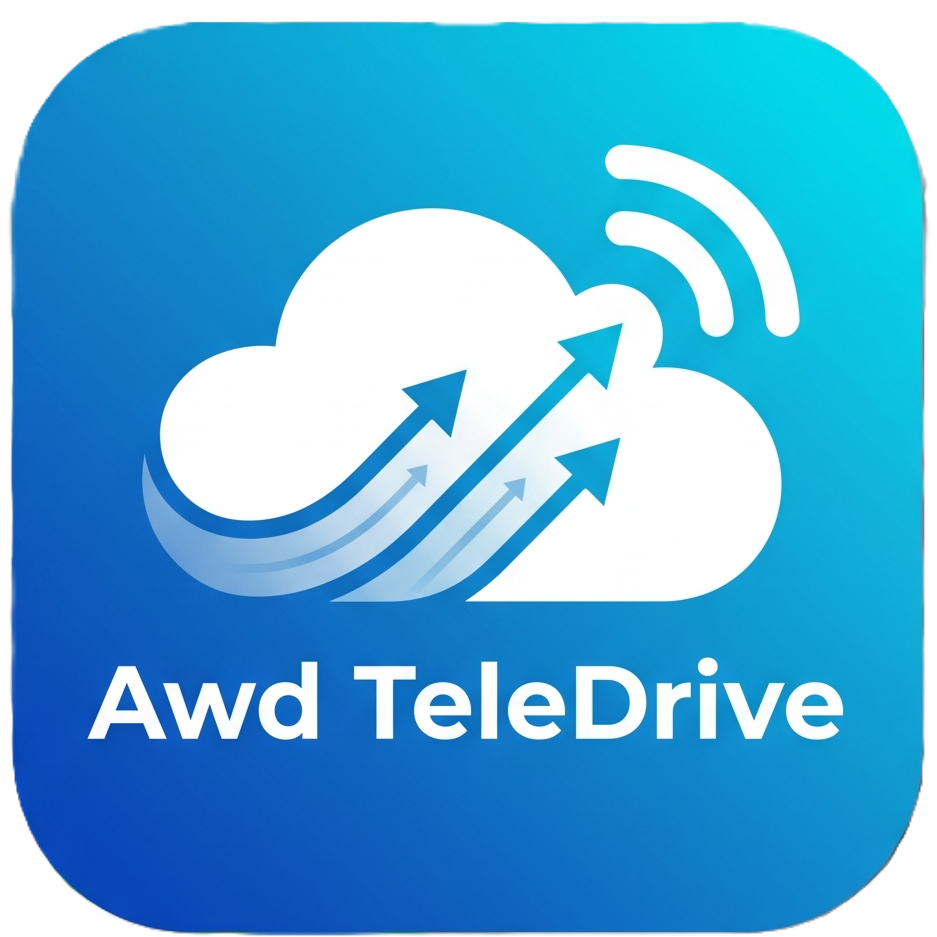
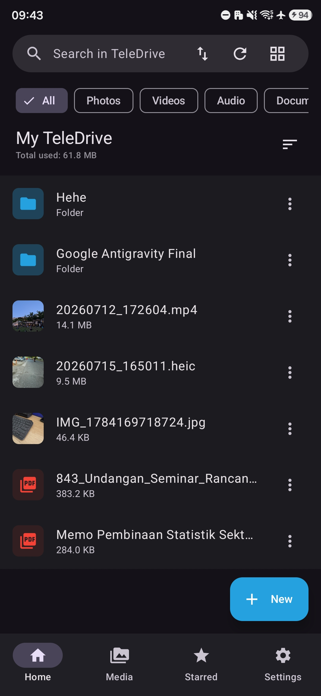
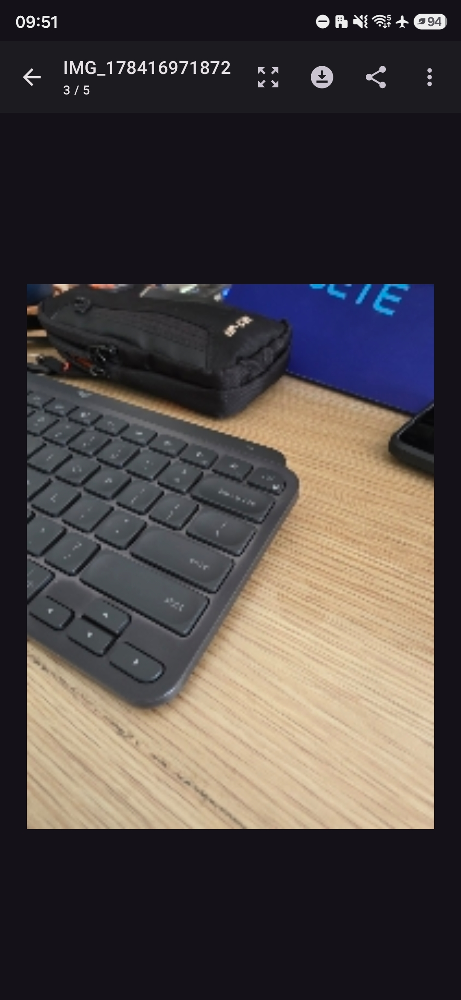
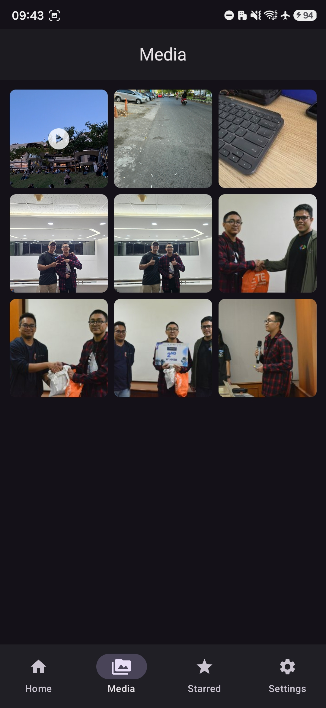
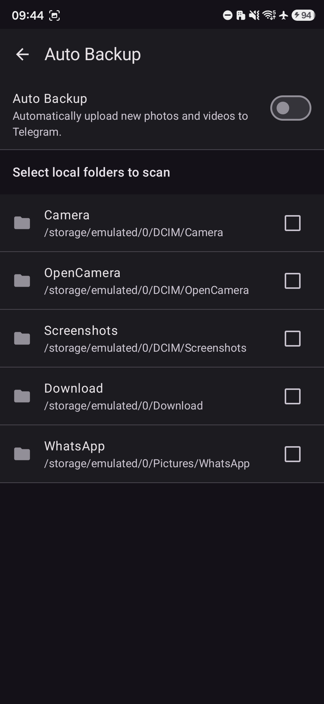
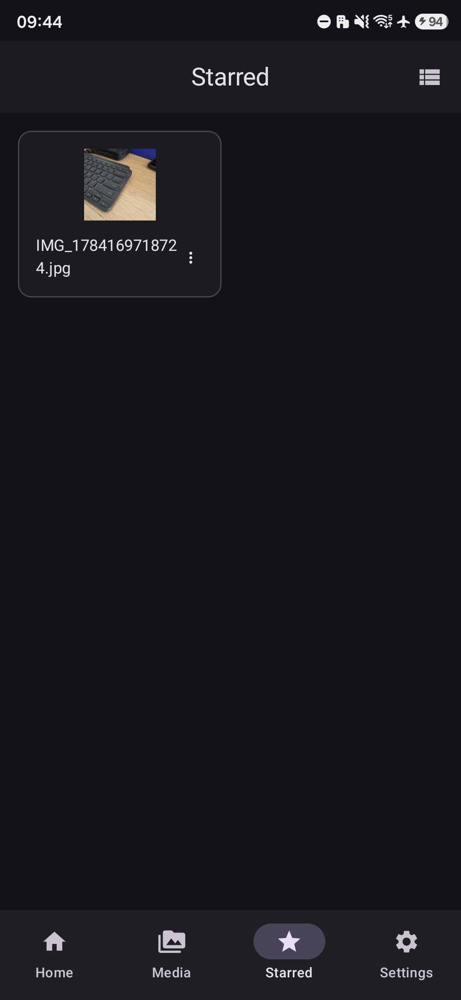
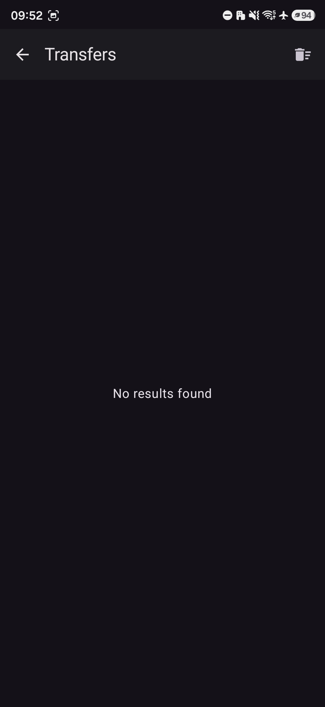

# Awd TeleDrive Android 📱🚀

<p align="center">
  
</p>

<p align="center">
  <a href="https://github.com/putuwahyu29/awd-teledrive-android/blob/main/LICENSE">
    
  </a>
  
  
  
  
</p>

**Awd TeleDrive Android** is an innovative Android application that transforms your Telegram account into an unlimited, secure personal cloud storage drive. Manage files, automate background backups, and navigate your media directory through a modern Material 3 interface built entirely with Jetpack Compose.

---

## 🌐 Teledrive Ecosystem
This application is part of a cross-platform ecosystem designed to turn Telegram into your personal unlimited cloud storage:
*   **📱 [Awd TeleDrive Android](https://github.com/putuwahyu29/awd-teledrive-android)**: Secure Android file manager and backup tool.
*   **💻 [Awd TeleDrive Desktop](https://github.com/putuwahyu29/awd-teledrive-desktop)**: High-performance Wails (Go) + React desktop client with two-way sync, local decryption, and Cloudflare Web Sharing.
*   **📸 [Awd TelePhoto Android](https://github.com/putuwahyu29/awd-telephoto-android)**: Companion app for client-side encrypted photo/video backup.

---

## 🌐 Language / Bahasa
*   [English Version (Main)](README.md)
*   [Versi Bahasa Indonesia](README.id.md)

---

## 📌 Table of Contents
- [✨ Key Features](#-key-features)
- [📷 Screenshots](#-screenshots)
- [📊 Feature Comparison Matrix](#-feature-comparison-matrix)
- [📁 Storage & Paths](#-storage--paths)
- [🚀 Getting Started & User Guide](#-getting-started--user-guide)
  - [Prerequisites](#prerequisites)
  - [How to Obtain Telegram API Credentials](#how-to-obtain-telegram-api-credentials)
  - [Logging In](#logging-in)
  - [Auto Backup Setup](#auto-backup-setup)
- [🛠️ Developer Guide](#️-developer-guide)
  - [Project Directory Structure](#project-directory-structure)
  - [Building from Source](#building-from-source)
- [⚙️ Troubleshooting](#️-troubleshooting)
- [⚠️ Disclaimer](#️-disclaimer)
- [📄 License](#-license)

---

## ✨ Key Features

*   **☁️ Unlimited Telegram Cloud Storage**: Leverage the Telegram API to upload and store files of any size. Built-in **Auto-Split** technology automatically handles files larger than the 2GB limit.
*   **📂 Professional File Management**: Create directories, rename items, search file catalogs, and mark files as favorites. Support for **Archived Channels** as folders.
*   **🔄 Auto Backup Service**: Automatically sync media from selected local folders to the cloud in the background using Android WorkManager.
*   **🔒 Double-Layer Security**: App lock with Master Password, Biometrics unlock (Fingerprint/Face ID), and secure local data cryptography (LazySodium).
*   **🎨 Material 3 Dynamic Design**: Modern user interface that changes themes dynamically based on your device's wallpaper and system-wide dark/light mode settings.

---

## 📷 Screenshots

| | | |
|:---:|:---:|:---:|
| <br/>**Home / File Explorer** | <br/>**File Preview & Viewer** | <br/>**Media Gallery** |
| <br/>**Automatic Backup** | <br/>**Starred / Favorites** | <br/>**Transfer Manager** |

---

## 📊 Feature Comparison Matrix

| Feature | 📱 Awd TeleDrive Android | 💻 Awd TeleDrive Desktop | 📸 Awd TelePhoto Android |
| :--- | :---: | :---: | :---: |
| **Unlimited Cloud Storage** | Yes (Auto-Split for >2GB) | Yes (Any file size) | Yes (Photos & Videos) |
| **File & Folder Manager** | Yes | Yes | Gallery View only |
| **Sync / Backup Mode** | Local folder backup | One-Way & Two-Way Sync | Auto Photo/Video Backup |
| **Security / Encryption** | Master Password, Biometrics | AES-256 Decryption (Telephoto) | Client-side AES-256-GCM |
| **Web Sharing (Public/Local)** | No | Yes (Cloudflare Tunnel & Local IP) | No |
| **Native Integration** | Android WorkManager | System Tray, Auto-Launch (Registry) | Android WorkManager |
| **Multi-Language Support** | Yes (EN / ID) | Yes (EN / ID) | Yes (EN / ID) |

---

## 📁 Storage & Paths

All persistent data, cached sessions, and databases are stored securely in Android's app-specific directories:

*   **TDLib Configuration**: Internally stored in `context.filesDir` (under `tdlib/` cache).
*   **Local Room Database**: `tele_drive_database` storing folder hierarchies, starred items, and synchronization queue metadata.
*   **Secure Preferences**: Local keys encrypted using Android Keystore System (`EncryptedSharedPreferences`).
*   **Media Temp Directory**: `context.cacheDir` storing chunked files during upload/download streams before final delivery.

---

## 🚀 Getting Started & User Guide

### Prerequisites
*   An active Telegram account.
*   An Android device running Android 8.0 (API 26) or higher.

### How to Obtain Telegram API Credentials
Awd TeleDrive Android requires your own API credentials to connect with Telegram's servers. This is free and takes less than 2 minutes:
1. Go to [my.telegram.org](https://my.telegram.org/) and log in with your phone number.
2. Select **API development tools**.
3. Fill in the form (App title and short name of your choice).
4. Copy the **App api_id** and **App api_hash**.
5. Input these values in the configuration screen of the Awd TeleDrive Android app.

> [!NOTE]
> These credentials remain strictly local. The application communicates directly with Telegram's endpoints and does not send your data to any third-party servers.

### Logging In
1. Launch the application and enter your **API ID** and **API Hash**.
2. Provide your phone number in international format (e.g., `+628123456789`).
3. Enter the OTP code sent to your Telegram application or via SMS.
4. If you have 2-Step Verification enabled, provide your 2FA Password.

### Auto Backup Setup
1. Go to the **Auto Backup** settings tab.
2. Grant the app permission to access media/files.
3. Select local folders (e.g., Camera, Downloads) you wish to sync.
4. Choose the destination chat or channel in Telegram.
5. The background worker will run automatically when connected to Wi-Fi.

---

## 🛠️ Developer Guide

### Project Directory Structure
```
awd-teledrive-android/
├── app/                    # Core Android App Module
│   ├── src/
│   │   ├── main/
│   │   │   ├── java/com/awd/teledrive/
│   │   │   │   ├── data/        # Room Database, API and TDLib implementation
│   │   │   │   ├── di/          # Dependency Injection (Hilt modules)
│   │   │   │   ├── domain/      # Domain business logic & models
│   │   │   │   ├── ui/          # MVI Presentation / Compose Screens
│   │   │   │   └── worker/      # WorkManager tasks for auto-backup
│   │   │   └── AndroidManifest.xml
│   │   └── build.gradle.kts
├── gradle/                 # Gradle Wrapper configurations
├── build.gradle.kts        # Root build configuration
└── settings.gradle.kts     # Module registrations
```

### Building from Source
Ensure you have the latest Android Studio installed.

1. **Clone the Repository**:
   ```bash
   git clone https://github.com/putuwahyu29/awd-teledrive-android.git
   ```
2. **Build with Gradle Wrapper**:
   Open a terminal in the root directory and run:
   ```bash
   # Clean & Build project
   ./gradlew clean build
   
   # Assemble Debug APK
   ./gradlew assembleDebug
   ```
3. **Deploy to Device/Emulator**:
   Connect an Android device with USB debugging enabled, then execute:
   ```bash
   ./gradlew installDebug
   ```

---

## ⚙️ Troubleshooting

*   **WorkManager Sync Delays**: Android may postpone background synchronization to conserve battery. You can disable battery optimizations for Awd TeleDrive Android in the Android Settings panel to resolve this.
*   **TDLib Initialization Errors**: Ensure your device has enough free space. If corruption occurs, clear the application cache from Settings ➡️ Apps ➡️ Awd TeleDrive Android ➡️ Clear Data.
*   **OTP Verification Fails**: Double-check that your `api_id` and `api_hash` match the credentials generated on `my.telegram.org`.

---

## ⚠️ Disclaimer

This project is an independent open-source development created solely for educational and learning purposes. It is not affiliated, associated, authorized, endorsed by, or in any way officially connected with Telegram Messenger or any other company or party.

Users are solely responsible for ensuring their usage of this application complies with Telegram's Terms of Service and any applicable local or international laws. The developers assume no liability for any misuse, policy violations, account actions, or legal consequences resulting from the use of this software.

---

## 📄 License

This project is licensed under the MIT License. See the [LICENSE](LICENSE) file for the full license text.

---

<p align="center">Made with ❤️ by <a href="mailto:aguswahyu@office.awd.my.id">I Putu Agus Wahyu Dupayana</a></p>
